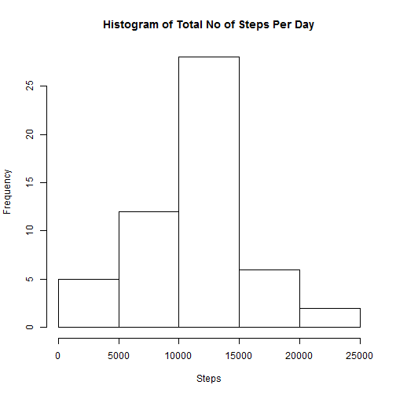
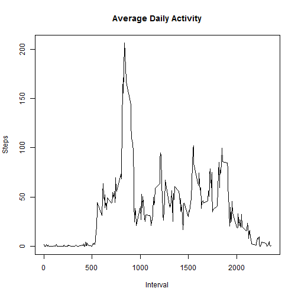
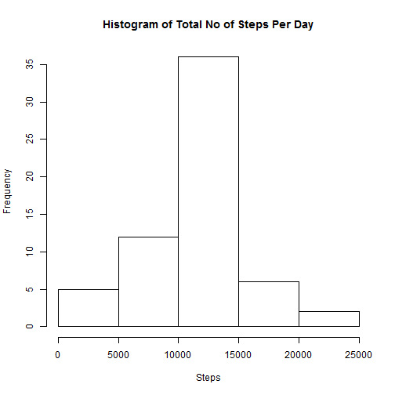
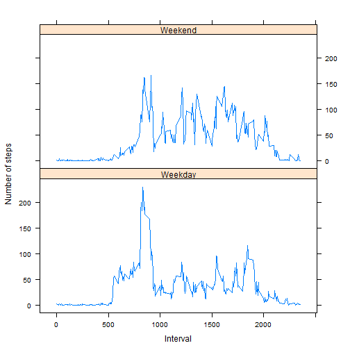

The file **activity.csv** can be downloaded from <https://d396qusza40orc.cloudfront.net/repdata%2Fdata%2Factivity.zip>.

Upload the **activity.csv** file


```r
df <- read.csv("activity.csv") 
```

Calculate the total number of steps taken per day

If you do not understand the difference between a histogram and a barplot, research the difference between them. Make a histogram of the total number of steps taken each day


```r
tot.steps.by.day <- aggregate(steps ~ date, 
                              data = df, 
                              FUN = sum, 
                              na.rm = TRUE)

hist(tot.steps.by.day$steps, 
     main = "Histogram of Total No of Steps Per Day", 
     xlab = "Steps")
```

 

Calculate and report the mean and median of the total number of steps taken per day


```r
mean(tot.steps.by.day$steps)
```

```
## [1] 10766.19
```

```r
median(tot.steps.by.day$steps)
```

```
## [1] 10765
```

What is the average daily activity pattern?

Make a time series plot (i.e. type = "l") of the 5-minute interval (x-axis) and the average number of steps taken, averaged across all days (y-axis)


```r
avg.steps.by.interval <- aggregate(steps ~ interval, 
                                   data = df, 
                                   FUN = mean,
                                   na.rm = TRUE)

plot(avg.steps.by.interval$interval, avg.steps.by.interval$steps, 
     xlab = "Interval", 
     ylab = "Steps", 
     main = "Average Daily Activity",
     type ="l")
```

 

Which 5-minute interval, on average across all the days in the dataset, contains the maximum number of steps?


```r
avg.steps.by.interval[which.max(avg.steps.by.interval$steps),
                      c("interval")]
```

```
## [1] 835
```

Inputing missing values

Note that there are a number of days/intervals where there are missing values (coded as NA). The presence of missing days may introduce bias into some calculations or summaries of the data.

Calculate and report the total number of missing values in the dataset (i.e. the total number of rows with NAs)


```r
# total number of lines 
nrow(df)
```

```
## [1] 17568
```

```r
# number of NA
sum(is.na(df$steps))
```

```
## [1] 2304
```

```r
# % of NA to total number of lines
sum(is.na(df$steps)) / nrow(df) * 100
```

```
## [1] 13.11475
```

Devise a strategy for filling in all of the missing values in the dataset. The strategy does not need to be sophisticated. For example, you could use the mean/median for that day, or the mean for that 5-minute interval, etc.

Create a new dataset that is equal to the original dataset but with the missing data filled in.


```r
df.filled <- df

# create a temporary column with index numbers
df.filled$rownum <- c(1:nrow(df))

# fill NA values with the corresponding mean value of interval
df.filled$steps[is.na(df$steps)] <- 
        sapply(df.filled$rownum[is.na(df.filled$steps)], 
               function(x) {x <- avg.steps.by.interval[avg.steps.by.interval$interval == 
                                                               df.filled$interval[x], 
                                                       c("steps")]})

# remove the temporary column
df.filled <- df.filled[,1:3]
```

Make a histogram of the total number of steps taken each day and Calculate and report the mean and median total number of steps taken per day. Do these values differ from the estimates from the first part of the assignment? What is the impact of imputing missing data on the estimates of the total daily number of steps?


```r
tot.steps.by.day.filled <- aggregate(steps ~ date, 
                                     data = df.filled, 
                                     FUN = sum, 
                                     na.rm = TRUE)

hist(tot.steps.by.day.filled$steps, 
     xlab = "Steps",
     main = "Histogram of Total No of Steps Per Day")
```

 

**The 2 histograms does not vary much. The number of NAs are about 13% of the total dataset. The first histogram when NA is omitted does not include the 13%. The second histogram shows the an increase in the frequency of steps in the middle range after the NA is substituted with average steps per interval.**  


```r
mean(tot.steps.by.day.filled$steps)
```

```
## [1] 10766.19
```

```r
median(tot.steps.by.day.filled$steps)
```

```
## [1] 10766.19
```

Are there differences in activity patterns between weekdays and weekends?

For this part the weekdays() function may be of some help here. Use the dataset with the filled-in missing values for this part.

Create a new factor variable in the dataset with two levels - "weekday" and "weekend" indicating whether a given date is a weekday or weekend day.

Make a panel plot containing a time series plot (i.e. type = "l") of the 5-minute interval (x-axis) and the average number of steps taken, averaged across all weekday days or weekend days (y-axis). See the README file in the GitHub repository to see an example of what this plot should look like using simulated data.


```r
# new factor and define the level
df.filled$daytype <- levels(df.filled$date)
df.filled$daytype <- factor(weekdays(as.POSIXlt(df.filled$date)))
levels(df.filled$daytype) <- list(Weekday = c("Monday","Tuesday",
                                              "Wednesday",
                                              "Thursday","Friday"), 
                                  Weekend = c("Saturday","Sunday"))

avg.steps.by.interval.daytype <- aggregate(steps ~ interval + daytype, 
                                           data = df.filled, 
                                           FUN = mean,
                                           na.rm = TRUE)

library(lattice)
xyplot(avg.steps.by.interval.daytype$steps ~ 
               avg.steps.by.interval.daytype$interval | 
               avg.steps.by.interval.daytype$daytype, 
       layout = c(1,2), 
       ylab="Number of steps", 
       xlab = "Interval", 
       type = "l")
```

 

**The graph shows that on Weekday, more steps are taken every morning, with less steps taken the rest of the day. For example, a person who likes to go for a jog in the morning before going to work. The steps on Weekend are more consistent, similar to a person who goes out every weekend.** 
